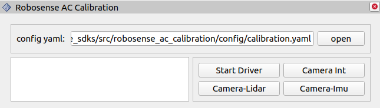

# calibration

[中文文档](README_CN.md)

## 1. Introduction

**calibration** is designed to provide camera intrinsic calibration and camera-lidar extrinsic calibration.

## 2. Prerequisites

This project is developed and tested based on `ROS2`. Follow the instructions in the [ROS2 Official Tutorial](https://fishros.org/doc/ros2/humble/Installation.html) according to your operating system. Additional dependencies include:

```bash
sudo apt install libceres-dev
```

## 3. Installation and Setup

### 3.1 Pulling Source Code

You can create a new folder or navigate to your existing `ros2` workspace. Then, execute the following command to clone the code into your workspace.

```bash
git clone git@gitlab.robosense.cn:super_sensor_sdk/ros2_sdk/calibration.git -b main
```

### 3.2 Build

In your workspace, execute the following command to build and install calibration.

```bash
colcon build
```

After the build is complete, it is recommended to refresh your workspace's `bash profile` to ensure the components function correctly.

```bash
source install/setup.bash
```

## 4. Configuration Files

Calibration parameter configuration: `config/calibration.yaml`

Calibration extrinsic result file: `config/calibration_result.yaml`

Calibration board configuration: `config/AprilTag_41h12_65-77.yaml`

Calibration Board Specifications: Users are recommended to create the calibration board with a size of 60cm×60cm. If the size is modified, update the calibration board configuration file accordingly.
<div style="width: 50%; margin: 0 auto;">
    
    <p style="margin-top: 2px;"></p>
</div>

## 5. Usage

### 5.1 Rviz Visualization

```bash
rviz2 -d src/calibration/config/default.rviz
```

<div align="center">
    
    <p style="margin-top: 2px;"></p>
</div>

### 5.2 Required Sensor Topics

- `/rs_camera/rgb` : Camera image topic
- `/rs_lidar/points` : Lidar point cloud topic
- `/rs_imu` : IMU topic

### 5.3 Camera Intrinsic Calibration

- ​**Load Configuration File**: Click the `Open` button in the top-right control panel to select the appropriate configuration file. Verify all parameters before loading.
- ​**Start Driver**: Click the `Start Driver` button in the control panel. The button will turn gray once initialization is complete.
- Click the `Camera Int` button in the control panel to enter camera intrinsic calibration mode. The program will display guidance frames (published on `/camera/image_indicate`) indicating the current calibration progress.

- ​**Capture Images**:  
  - Move the AC1 sequentially to ​**center-left-right-top-bottom** positions.  
  - At each position, capture 6 images by adjusting the orientation of the AC1 according to the guidance frames, ensuring the calibration board is captured from diverse angles for optimal quality.  

- ​**Alignment Guidance**:  
  - Move the AC1 to ensure the calibration board fully fits within the guidance frame and occupies as much area as possible.  
  - When conditions are met, the program triggers automatic detection and publishes results on `/camera/image_detecte`.  

- ​**Calibration Completion**:  
  - After capturing all images, the program automatically computes the intrinsic parameters and displays results in the output area and terminal.  
  - Expected accuracy ​within 1.0 pixel.  

- ​**References**:  
  - [Demo Video](https://cdn.robosense.cn/AC1Sensor%E5%88%B0%E8%BD%A6%E4%BD%93%E6%A0%87%E5%AE%9A.mp4)  
  - [Sample Data](https://cdn.robosense.cn/AC1camera_intrinsics_calib.zip)  

---

### 5.4 Camera-Lidar Extrinsic Calibration

- ​**Load Configuration File**: Click the `Open` button to load the correct configuration file.

- ​**Start Driver**: Click `Start Driver` to initialize the system.  

- ​**Calibration Board Setup Recommendations**:  
  - Ensure the board is within the ​**FOV** of both sensors (recommended distance: ​**0.8m~1m**). Use Rviz for verification.  
  - Tilt the board at ​**~45°** for optimal feature extraction.  
  - Mount the board ​**suspended** to avoid interference from background objects.  
  - Keep the AC1 ​**stable** to minimize motion-induced errors.  
  <div style="width: 80%; margin: 0 auto;">
    
  </div>

- ​**Start Calibration**:  
  - Click the `Camera-Lidar` button. The program automatically checks calibration conditions, computes extrinsic parameters, and displays results upon completion.  
  - Expected accuracy within 0.3°.  

- ​**Reference**:  
  - [Sample Data](https://cdn.robosense.cn/AC1camera_lidar_calib.zip)  

## 6. FAQ

[Create New Issue](http://gitlab.robosense.cn/super_sensor_sdk/ros2_sdk/calibration/-/issues/new)
