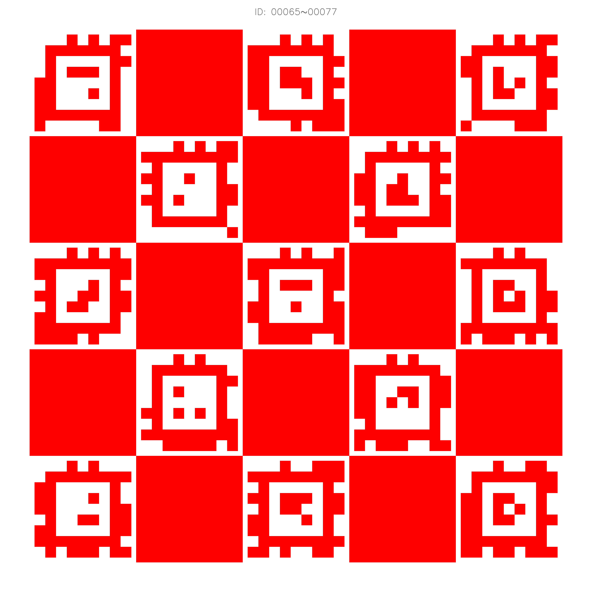

# Robosense AC Calibration

[README](README.md) | [中文文档](README_CN.md)

## 1. 简介

**Robosense AC Calibration** 用于提供速腾Active Camera的相机内参标定及相机-雷达外参标定

## 2. 前置依赖

此项目基于 `ros2` 进行开发测试，根据您的操作系统选择 [ROS2 官方教程](https://fishros.org/doc/ros2/humble/Installation.html) 中的指定内容进行执行。其他依赖包括

```bash
sudo apt install libceres-dev
```

## 3. 安装部署

### 3.1 代码拉取

您可以创建一个新的文件夹或进入您现有的 `ros2` 工作空间，执行以下命令将代码拉取到工作空间内

```bash
git clone https://github.com/RoboSense-Robotics/robosense_ac_calibration.git -b main
```

### 3.2 编译

在您的工作空间下执行以下命令来编译安装 `robosense_ac_calibration`

```bash
colcon build --packages-select robosense_ac_calibration
```

编译安装完成后，推荐刷新一下工作空间的 `bash profile`，确保组件功能正常

```bash
source install/setup.bash
```

## 4. 配置文件

标定参数配置文件：`config/calibration.yaml`

标定外参文件：`config/calibration_result.yaml`

标定板配置文件：`config/AprilTag_41h12_65-77.yaml`

标定板样式：推荐用户按照60cm*60cm尺寸进行制作，如果尺寸有变动，请按照实际尺寸修改标定板配置文件
<div style="width: 50%; margin: 0 auto;">
    
    <p style="margin-top: 2px;"></p>
</div>

## 5. 使用方式

### 5.1 Rviz 可视化

```bash
rviz2 -d src/robosense_ac_calibration/config/default.rviz
```

<div align="center">
    
    <p style="margin-top: 2px;"></p>
</div>

### 5.2 所需传感器消息

- `/rs_camera/rgb`   : 相机图像消息
- `/rs_lidar/points` : 雷达点云消息
- `/rs_imu` : 雷达点云消息

### 5.3 相机内参标定

- ​**加载配置文件** : 单击控件右上角`open`按钮，选择合理的配置文件进行加载，加载前请确认各配置项是否正确。

- ​**启动驱动** : 单击控件操作区`Start Driver`按钮，程序进行初始化，按钮变灰后可进行下一步。

- 单击控件操作区`Camera Int`按钮，进入相机内参标定模式，程序会根据当前标定进度输出引导框（话题 `/camera/image_indicate`）。

- ​**图像采集要求**：  
  - 用户需按照**中-左-右-上-下**五个位置顺序移动AC1，每个位置拍摄6张图像（根据引导框变换AC1的角度姿态），确保靶板图案从不同角度被充分且均匀地采集。  

- ​**靶板对齐指引**：  
  - 移动AC1使靶板图案完全落入引导框内，并尽可能填充引导框面积。符合条件后程序自动触发检测，结果通过话题`/camera/image_detecte`发布。  

- ​**标定完成**：  
  - 完成所有图像采集后，程序自动执行标定计算，结果在输出区与终端显示。  
  - 预期标定精度在1.0像素以内。  

- ​**参考资源**：  
  - [示例视频](https://cdn.robosense.cn/AC_wiki/camera_intrinsics_calib.mp4)  
  - [Demo数据包](https://cdn.robosense.cn/AC_wiki/camera_intrinsics_calib.zip)

### 5.4 相机-雷达外参标定

- ​**加载配置文件** : 单击控件右上角`open`按钮，选择合理的配置文件进行加载，加载前请确认各配置项是否正确。

- ​**启动驱动** : 单击控件操作区`Start Driver`按钮，程序进行初始化，按钮变灰后可进行下一步。

- ​**靶板布置建议**：  
  - 确保靶板在图像和点云的**视场角（FOV）​**内（推荐距离：​**0.8m~1m**），可通过Rviz可视化工具验证。  
  - 将靶板**倾斜约45°**以增强特征识别。  
  - ​**悬空安装靶板**，避免背景物体点云干扰。  
  - 保持AC1**稳定**，减少传感器抖动带来的误差。  
  <div style="width: 80%; margin: 0 auto;">
    
  </div>

- ​**开始标定**：  
  - 单击控件操作区`Camera-Lidar`按钮，程序自动检测标定状态并计算外参，完成后在输出区和终端显示结果。  
  - 预期标定精度在0.3°以内。  

- ​**参考资源**：  
  - [Demo数据包](https://cdn.robosense.cn/AC_wiki/camera_lidar_calib.zip)

## 6. FAQ

[Create New Issue](https://github.com/RoboSense-Robotics/robosense_ac_calibration/issues/new)
